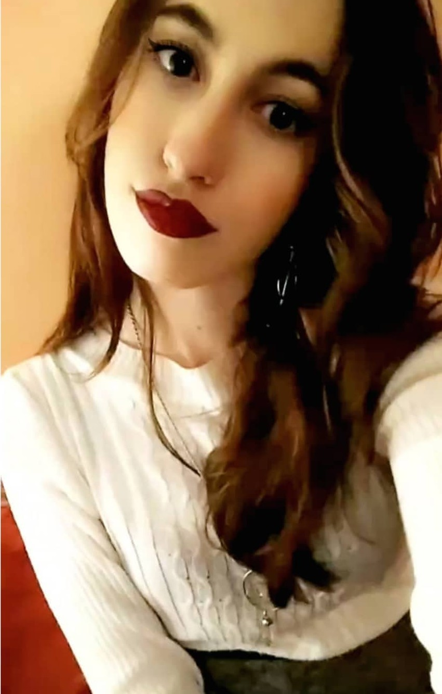
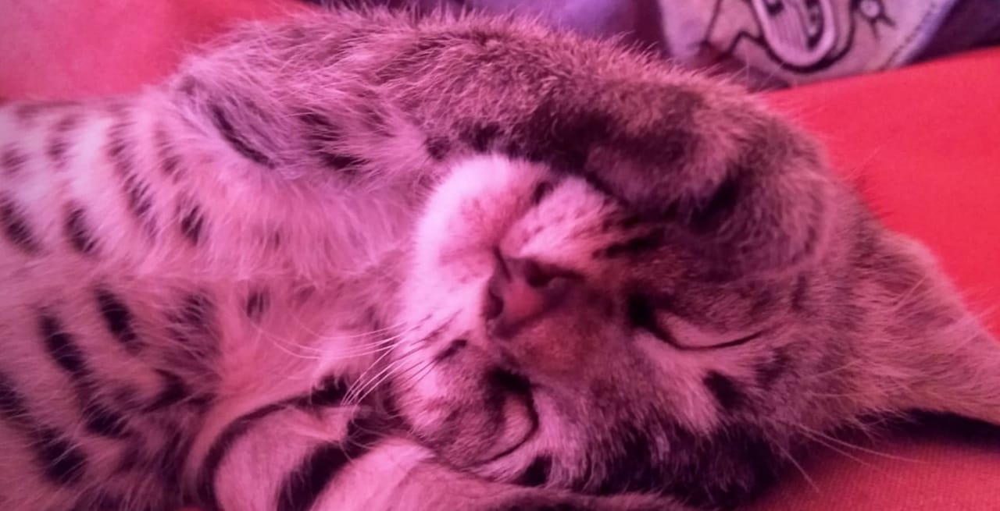

# Presentación

    Hola a todos! 
    Legajo: 1718344
    

    Mi nombre es Julia Martí y este es mi segundo año en la UTN, pero antes de entrar   
    estuve de acá para allá en la UBA, 2 años de psicología y uno de diseño de imagen   
    y sonido metido en el medio (muy relacionadas todas las carreras por suerte).   
    Espero que la tercera sea la vencida.  

    Doy clases particulares para subsistir, uso la bici como principal medio de   
    transporte (salvo para campus), me gusta mucho cantar y estoy incursionando   
    en el mundo de la producción musical a prueba y error con videítos de youtube. 

    En cuanto a mis conocimientos de programación son bastante escasos, muy poco    
    de c++ por algoritmos, y algo de html, css y boostrap por más benditos videítos   
    de youtube.
    
   Les dejo una foto de Cosette (Nombre puesto por la nena de Los Miserables, que sería mi película favorita) y mi [Instagram](https://www.instagram.com/juulimarti/?hl=es-la)
   
   

      Muy buena cursada! Saludos
